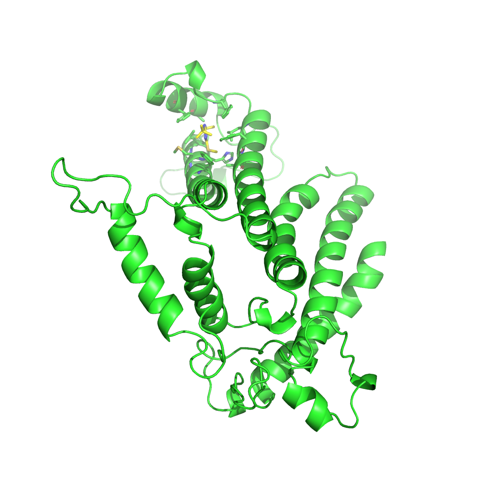

 # Homology Modeling and Structural Validation of the Phalaris minor D1 Protein

## Project Overview
This repository contains the computational pipeline and structural data for the 3D homology modeling of the D1 protein from *Phalaris minor*. The primary objective of this project is to generate a thermodynamically stable 3D model of the D1 binding pocket to analyze its structural interaction with the herbicide terbutryn (MST). 

The cyanobacterial Photosystem II complex (PDB ID: `4V82`) was utilized as the structural template due to its high sequence identity and the presence of co-crystallized terbutryn within the active site.

## Repository Structure
* `/data`: Contains the raw structural inputs, including the target FASTA sequence, the prepared `4V82.cif` template, and the formatted alignment file (`alignment.pir`).
* `/scripts`: Contains the Python automation scripts (`build.py`) used to interface with MODELLER.
* `/results`: Contains the top-scoring `.pdb` model, high-resolution PyMOL render states, and structural validation reports (PROCHECK/ERRAT).

## Software Prerequisites
* **MODELLER (v10.5)**: For spatial restraint calculations and 3D coordinate generation.
* **PyMOL (Open-Source)**: For structural alignment, ligand extraction, and high-resolution rendering.
* **SAVES v6.0 Server**: For stereochemical and non-bonded interaction validation.

---

## Methodology

### 1. Data Pre-Processing & Sequence Alignment
* **Template Preparation:** The `4V82` multi-chain structure was retrieved from the Protein Data Bank. Prior to alignment, crystallographic water molecules (HOH) and non-essential heteroatoms were explicitly stripped from the template to prevent spatial anomalies during coordinate generation.
* **Alignment Generation:** The target *P. minor* sequence was aligned with the template sequence. The alignment was formatted into standard MODELLER `.pir` syntax, ensuring strict termination characters (`*`) were utilized to prevent sequence length mismatches.

### 2. 3D Model Generation
* **Environment Isolation:** Model building was executed natively, bypassing aggressive Python environments to ensure proper pathing for the MODELLER libraries (`$PYTHONHOME` integrity).
* **Automated Folding:** Five distinct 3D models were generated using standard automodel routines to calculate spatial restraints.
* **Model Selection:** The models were evaluated using the Discrete Optimized Protein Energy (DOPE) scoring function. Model 2 (`ABV45437.B99990002.pdb`) yielded the most thermodynamically favorable DOPE score (**-32027.59**) and was selected for downstream analysis.

### 3. Targeted Ligand Superposition
Because the `4V82` template is a massive 40-chain macromolecular complex, standard global alignments result in significant spatial drift.
* The top-scoring D1 homology model was imported into PyMOL alongside the raw `4V82` template.
* **Chain-Specific Alignment:** Superposition was strictly targeted against **Chain AA** of the template (`align ABV*, 4V82 and chain AA`). This ensured the *P. minor* alpha-helical bundle perfectly matched the physical coordinates of the specific terbutryn binding site.
* The terbutryn molecule (Residue ID: `MST`) was extracted, and interacting pocket residues within a 4.0 Å radius were isolated for visualization.

---

## Structure Validation

The stereochemical quality and global 3D profile of the final *Phalaris minor* D1 model were rigorously evaluated using the SAVES v6.0 server to ensure mathematical and physical viability.

### Stereochemical Quality (PROCHECK)
The Ramachandran plot analysis indicates a highly reliable and thermodynamically stable model, with strict clustering in the alpha-helical and beta-sheet regions:
* **92.1%** of residues are located in the most favoured regions.
* **7.9%** of residues are in additional allowed regions.
* **0.0%** of residues are in generously allowed or disallowed regions.

This total absence of residues in disallowed regions, combined with a >90% favoured score, mathematically confirms the structural integrity of the protein backbone.

### Non-Bonded Interactions (ERRAT)
The model achieved an Overall Quality Factor of **90.06**, indicating that the distribution of non-bonded atomic interactions is highly consistent with high-resolution, experimentally determined structures.

### Validation Reports
Full validation statistics can be reviewed in the raw output files:
* [View PROCHECK Ramachandran Analysis (PDF)](results/procheck.pdf)
* [View ERRAT Non-Bonded Interactions (PDF)](results/errat.pdf)

*(Optional: If you took a screenshot of the Ramachandran plot, you can view it below:)* 

---

## Final Structural Complex

The validated model successfully accommodates the terbutryn (MST) ligand within the D1 active site. The rendered complex below highlights the specific amino acid residues (within 4.0 Å) responsible for stabilizing the herbicide.

